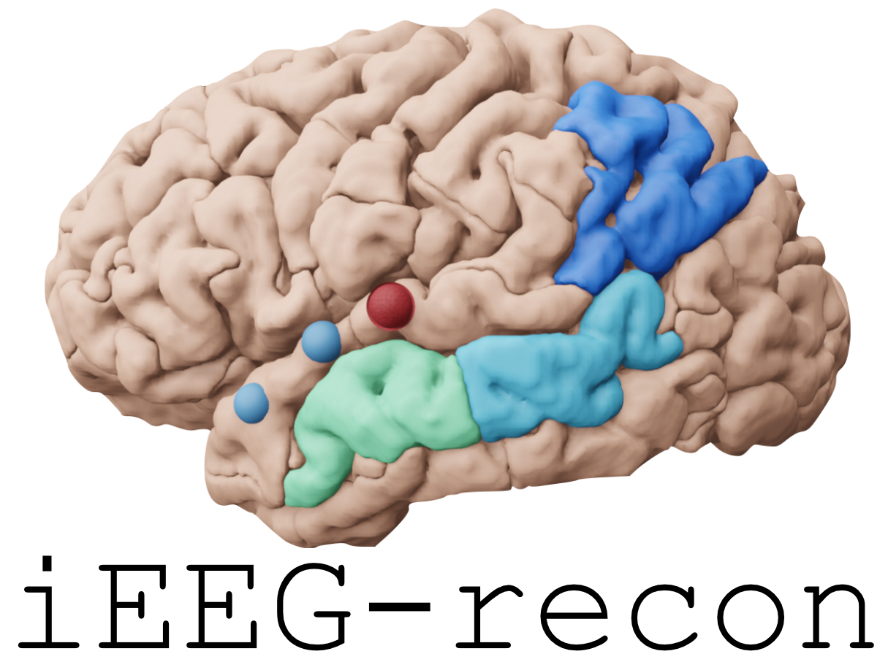

====

IEEG-recon is a modular pipeline to reconstruct iEEG electrode locations in MRI images. The pipeline is available in both MATLAB and python computing environments. 

.. image:: docs/source/images/OHBM.png
  :width: 800
  :alt: IEEG-recon pipeline

Get Started
------------
See https://ieeg-recon.readthedocs.io/

Paper
----------
If you use IEEG-recon, please cite our paper:

**Lucas A, Scheid BH, Pattnaik AR, Gallagher R, Mojena M, Tranquille A, Prager B, Gleichgerrcht E, Gong R, Litt B, Davis KA, Das S, Stein JM, Sinha N. iEEG-recon: A fast and scalable pipeline for accurate reconstruction of intracranial electrodes and implantable devices. Epilepsia. 2024 Mar;65(3):817-829. doi: 10.1111/epi.17863. Epub 2024 Jan 10. PMID: 38148517; PMCID: PMC10948311.**

