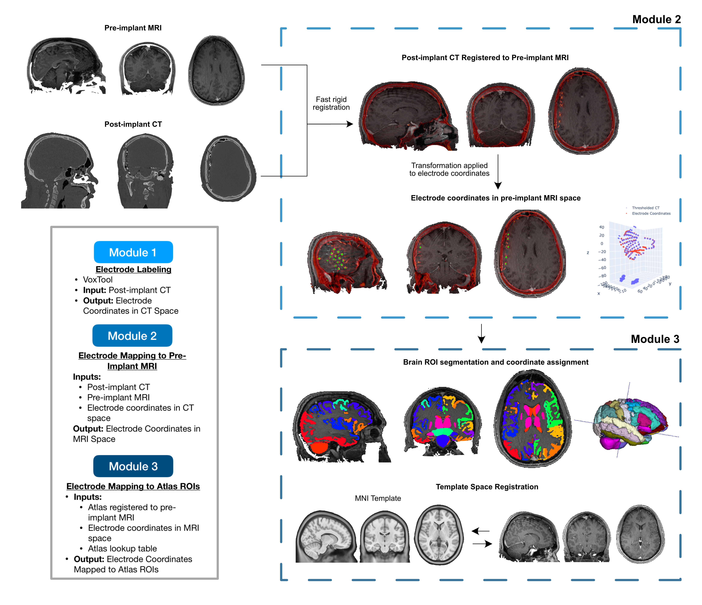

.. role:: red
.. role:: blue
.. role:: green
.. role:: pink
.. role:: cyan

.. |sp| unicode:: U+00A0 .. non-breaking space

Getting Started
================

====

Quickstart: Run iEEG-recon App with Docker
-----------------------------------------------

We recommend installing the **iEEG-recon** App that runs in our standalone Docker container. This quickstart option eliminates the overhead of manually installing multiple third-party software packages. However, if you would like to tinker with the codebase, the subsequent sections detail the steps to get iEEG-recon up and running in python or MATLAB. 

.. note::
   
   **For Mac M1/M2 users:** Make sure you change your terminal to run with Rosetta before completing the following steps. To do so, open `Finder -> Applications -> Utilities`, then right click the `Terminal` app, and select `Get Info`. Under `General`, select `Open using Rosetta`


#. Install the following dependencies:

   * `Docker <https://hub.docker.com>`_

   * `Anaconda <https://hub.docker.com>`_
  
#. In a Terminal window, download the latest release of **iEEG-recon**:  
      ``git clone https://github.com/penn-cnt/ieeg-recon.git``
#. Open **iEEG-recon** in a Terminal window, then run the installation command: 
       ``bash ieeg-recon/python/install_ieeg-recon_gui_docker.sh``
#. The **iEEG-recon** application should now be found in your Applications folder
#. Follow instructions on the :ref:`Running the App` page. 


====

Requirements
--------------

The following software packages are required to run **iEEG-recon** in Python or MATLAB:

*  `Anaconda <https://www.anaconda.com/products/distribution>`_  (Note, make sure you download the correct version for your operating system)
*  `MATLAB <https://matlab.mathworks.com>`_ >=2020a (only if using MATLAB tools)
* `FSL <https://fsl.fmrib.ox.ac.uk/fsl/fslwiki/FslInstallation>`_ >= 3.8.0 
   *  Ensure that $FSLDIR environment variable is sourced on your terminal path. 
* Greedy and C3D (optional, recommended): 
   *  Mac and Windows: Install `ITK Snap <http://www.itksnap.org/pmwiki/pmwiki.php?n=Main.HomePage>`_ >= V3.2. Open ITK Snap and click on `Help` > `Install Command Line Tools`.
   *  Linux: Download the `Greedy binary <https://sourceforge.net/projects/greedy-reg/files/Nightly/>`_ and `C3D binary <https://sourceforge.net/projects/c3d/files/c3d/Nightly/>`_, OR `compile from source <http://www.itksnap.org/pmwiki/pmwiki.php?n=Documentation.CommandLine>`_.


.. _install:

Installation
------------

To use **iEEG-recon**, first clone the repository:

.. code-block:: console

   $ git clone git@github.com:penn-cnt/ieeg-recon.git


.. tabs::

   .. tab:: Python

      To install the **iEEG-recon** GUI:

      .. code-block:: console
         
         $ bash ieeg-recon/python/install_ieeg-recon_gui_m1m2.sh
      
      To run from the command line, create conda environment from dependancies: 

      .. code-block:: console

         $ cd python
         $ conda env create -f ieeg_recon_config.yml 

   .. tab:: MATLAB

      Set the FSLDIR and ITKSNAPDIR environment variables in ``~/../MATLAB/startup.m``. You you may need to update the paths to reflect the location of FSL and ITK-Snap on your local system.
      
      .. code-block:: MATLAB

         %% in MATLAB/startup.m
         
         % Set FSLDIR to FSL install location
        setenv( 'FSLDIR', '/usr/local/fsl' );
        setenv('FSLOUTPUTTYPE', 'NIFTI_GZ');
        fsldir = getenv('FSLDIR');
        fsldirmpath = sprintf('%s/etc/matlab',fsldir);
        path(path, fsldirmpath);
        clear fsldir fsldirmpath;

         % Set ITKSNAPDIR to ITK-Snap install location
        setenv('ITKSNAPDIR', '/Applications/ITK-SNAP.app/Contents/bin');
        itksnapdir = getenv('ITKSNAPDIR');
        itksnapmpath = sprintf('%s',itksnapdir);
        path(path,itksnapmpath)
        clear itksnapdir itksnapmpath;


.. .. tab:: Docker

..     #. In a terminal window, run: ```docker pull lucasalf11/ieeg_recon`
..     #. Follow :ref:`Module 1`` instructions to label coordinates using VoxTool
..     #. Organize data as described in :ref:`Data Setup`
..     #. Run Module 2 and Module 3 together (-m -1) for a given patient using the Greedy (-gc) and AntsPyNet (-apn) options for Module 2, and setting radius to 2 mm for module 3 (-r 2), and using the default atlas. 

..    .. code-block:: console

..       $ docker run -v </path/to/data>:/source_data lucasalf11/ieeg_recon -s sub-<subjectID> -cs ses-<session_name> -rs ses-<session_name> -gc -m -1 -apn -r 2 -d /source_data

..    Example: 

..    .. code-block:: console

..       $ docker run -v /Users/username/:/source_data lucasalf11/ieeg_recon -s sub-<subjectID> -cs ses-<session_name> -rs ses-<session_name> -gc -m -1 -apn -r 2 -d /source_data

..    .. note:: 

..       To run with `Singularity <https://sylabs.io>`_ insead of Docker: ``singularity pull docker://lucaslf11/ieeg_recon``. Click here for a lookup table of Docker to Singularity commands.


.. _Data Setup:

Data Setup
----------------

**iEEG-recon** takes a reference MRI scan and a post-operative CT scan in NIfTI format (.ni.gz) as inputs. The data must be organized for each subject in a `BIDS-like <https://bids.neuroimaging.io>`_ folder structure as follows: 

   | BIDS/
   |  |__ :blue:`sub-XXXX`/
   |   |__ :red:`ses-YYYY`/
   |       |sp| |sp|  |__anat/ 
   |       |sp| |sp| | |sp| |sp| |sp|      |__ :blue:`sub-XXXX_`:red:`ses-YYYY`\_acq-3D\_\ :green:`space-T00mri`\_\ :pink:`T1w`.nii.gz
   |       |sp| |sp|  |__ ct/
   |       |sp| |sp| | |sp| |sp| |sp|  |__ :blue:`sub-XXXX_`:red:`ses-YYYY`\_acq-3D\_\ :green:`space-T01ct`\_\ :pink:`ct`.nii.gz
   |       |sp| |sp|  |__ ieeg/
   |        |sp| |sp|  |sp| |sp|    |__ :blue:`sub-XXXX_`:red:`ses-YYYY`\_\ :green:`space-T01ct`\_ :cyan:`desc-vox`\_\ :pink:`electrodes`.txt


   *   Subject folders begin with ``sub-`` and are placed at the top level.
   *   Session folders begin with ``ses-`` and are nested within subject folders. Session names can be used to describe the type of scanning session (e.g. ``ses-clinical`` or ``ses-research3T``).
   *  In each session folder,  the ``anat/``, ``ct/``, and ``ieeg/`` folders contain the reference MRI, CT scan, and coordinate files respectively. Note that the coordinate file will be generated in Module 1. 
   *  Breakdown of image filenames: 

      .. image:: images/usage_naming.png
         :width: 400
         :alt: Single contact selected
         :align: center

Below is an example file structure for the example data referenced throughout this tutorial. The example data be `downloaded here <https://www.dropbox.com/sh/ylxc586grm0p7au/AAAs8QQwUo0VQOSweDyj1v_ta?dl=0>`_:

   | /path/to/exampleData/
   |  |__ :blue:`sub-RID0675`/
   |  | |sp| |sp|  |__ :red:`ses-clinical01`/
   |  | |sp| |sp| | |sp| |sp| |__anat/ 
   |  | |sp| |sp| | |sp| |sp| | |sp| |sp| 
     |__ :blue:`sub-RID0675_`:red:`ses-clinical01`\_acq-3D\_\ :green:`space-T00mri`\_\ :pink:`T1w`.nii.gz
   |  | |sp| |sp| | |sp| |sp| |__ct/ 
   |  | |sp| |sp| | |sp| |sp| | |sp| |sp| 
     |__ :blue:`sub-RID0675_`:red:`ses-clinical01`\_acq-3D\_\ :green:`space-T01ct`\_\ :pink:`ct`.nii.gz
   |  | |sp| |sp| | |sp| |sp| |__ieeg/ 
   |  | |sp| |sp| | |sp| |sp| |sp| |sp| |sp| 
      |__ :blue:`sub-RID0675_`:red:`ses-clinical01`\_\ :green:`space-T01ct`\_ :cyan:`desc-vox`\_\ :pink:`electrodes`.txt
   |  | |sp| |sp|  |__ :red:`ses-research3T`/
   |  | |sp| |sp| | |sp| |sp| |__anat/ 
   |  | |sp| |sp| | |sp| |sp| | |sp| |sp| 
     |__ :blue:`sub-RID0675_`:red:`ses-research3T`\_acq-3D\_\ :green:`space-T00mri`\_\ :pink:`T1w`.nii.gz
   |  |__ :blue:`sub-RID0864`/
   |  |__ :blue:`sub-RID0922`/



.. autosummary::
   :toctree: generated

   ieeg-recon


