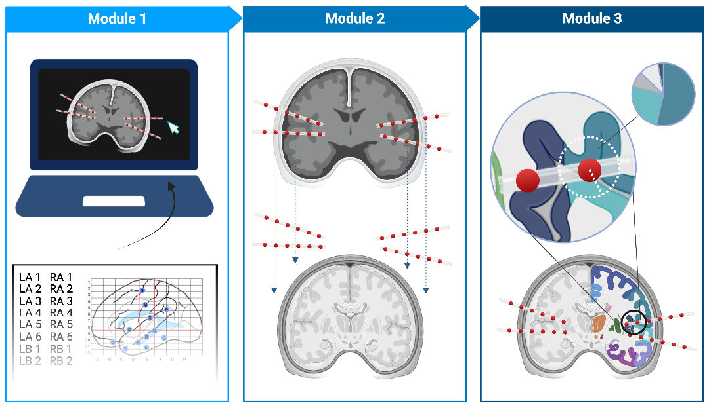

IEEG-Recon
===========

**IEEG-recon** is a modular pipeline used to reconstruct intracranial electrode coordinates from a post-implant CT scan, into a pre-implant MRI.  The pipeline is available in both MATLAB and python computing environments.

iEEG-Recon is divided into 3 modules:

* :doc:`module 1` consists of an electrode labeling GUI called VoxTool, which allows the user to label electrode locations in the post-implant CT scan.
* :doc:`module 2` registers the CT scan to the pre-implant MRI and transforms the VoxTool-generated coordinates from CT space to MRI space
* :doc:`module 3` maps each electrode to a specific ROI defined by a brain atlas registered to the pre-implant MRI

Please Cite Us!
----------------
If you use IEEG-recon, please cite our paper: Alfredo Lucas, Brittany H Scheid, Akash Ranjan Pattnaik, Ryan Gallagher, Marissa Mojena, Ashley Tranquille, Brian Prager, Ezequiel Gleichgerrcht, Ruxue Gong, Brian Litt, Kathryn A Davis, Sandhitsu Das, Joel M Stein, & Nishant Sinha. (2023). iEEG-recon: A Fast and Scalable Pipeline for Accurate Reconstruction of Intracranial Electrodes and Implantable Devices. MedRxiv, 2023.06.12.23291286. https://doi.org/10.1101/2023.06.12.23291286

Check out the :doc:`Getting Started` section for further information, including project :ref:`install`.

Table of Contents
------------------

.. toctree::
   introduction
   Getting Started
   Running the App
   module 1
   module 2
   module 3
   troubleshooting

