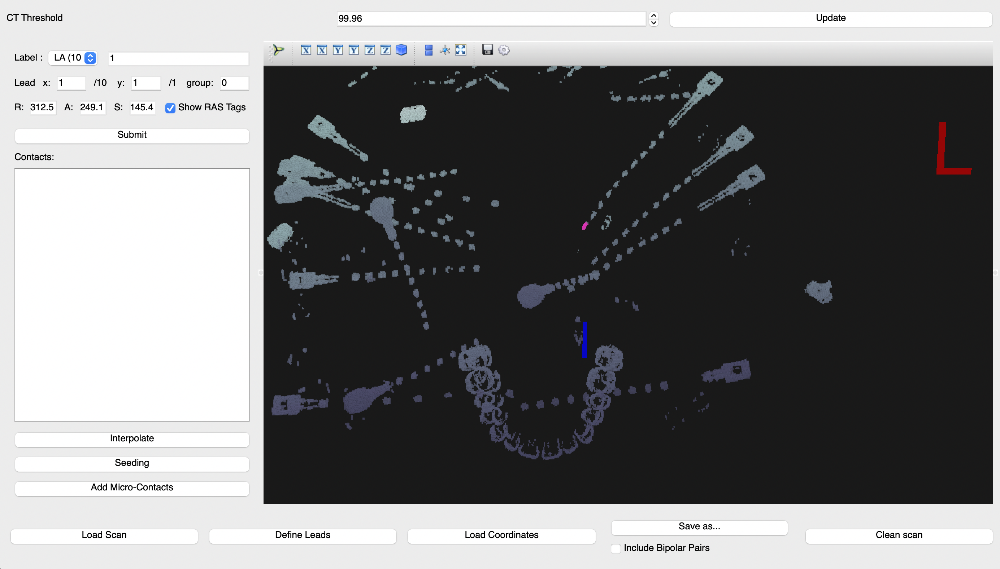

.. role:: red
.. role:: blue
.. role:: green
.. role:: pink
.. role:: cyan

Module 1
==========

Purpose: Label electrodes in CT scans using **VoxTool 2.0**, a graphical user interface application. 

Description
--------------

In this module, electrode locations will be manually identified on a subject's CT scan. 
Make sure your input patient data is organized according to the pseudo-BIDS structure outlined in :ref:`Data Setup`.

*  **Inputs**: 
  
   *  post-implant CT (`ct/...acq-3D_space-T01ct_ct.nii.gz`)
   *  electrode labels

*  **Output**: 

   *  Electrode coordinates in CT space (`ieeg/...space-T01ct_desc-vox_electrodes.txt`)
  
Setup
---------

Make sure your input patient data is organized according to the pseudo-BIDS structure outlined in :ref:`Data Setup`. You can also run the tutorial with our `example data <https://www.dropbox.com/sh/ylxc586grm0p7au/AAAs8QQwUo0VQOSweDyj1v_ta?dl=0>`_.

Create a conda environment from the environment file in the VoxTool folder. 
This creates an environment named `vt` in which to run voxTool.

.. code-block:: console

  $ cd voxTool
  $ conda env create -f conda_env.yml

Run
------------

Activate the conda environment and launch the program: 

.. code-block:: console

   $ source activate vt
   $ python launch_pyloc.py

Label Electrodes
-----------------

.. centered::
   VoxTool GUI

1. Click on ``Load Scan`` in the bottom left corner to 
   load a subject's CT file (`anat/...acq-3D_space-T01ct_ct.nii.gz`). 
   If necessary, change the ``CT Threshold`` in the box at the top of the window, then press the ``Update`` button.

   .. note:: 

      If continuing a previous localization: load the existing coordinates
      from a JSON coordinate file using the ``Load Coordinates`` button.

2. Press ``Define leads`` to set the names, shapes, types (e.g. Depth, Grid, Strip), and microcontacts
   for each implanted lead. Shapes are rows x columns. Press confirm on the dialog when complete. 
3. To label electrode contacts: select a lead in the ``Label`` dropdown menu
   in the upper left corner. Ensure that the contact number and X,Y position are consistent 
   (e.g. for an 8x8 grid array, contact 9 corresponds to X=2, Y=1) . 
4. Click on the contact location in the CT. When it is highlighted, press ``Submit`` to mark its location.
   The electrode contact number and X, Y positions may automatically increment. 
5. Click on the next contact on the lead, then press ``Submit`` to mark its location

   - Alternatively, press the ``Seeding`` button to turn on seeding. VoxTool
     will attempt to extrapolate the locations of the remaing contacts
     as you select them, incrementing the contact number. Be sure to double-check that
     the results make sense, as occasionally two contacts
     will be given the same location

   - Alternatively, add the ends of a strip or depth
     or the corners of the grid with the ``Submit`` button, then press
     the ``Interpolate`` button. VoxTool will attempt to fill in the lead.
     It may not be completely successful. Pressing ``Interpolate`` again
     may interpolate additional contacts.

     .. note::

         The list of contact names is sorted by lead name, and within each 
         lead by contact number. The ``Interpolate`` button does not always assign
         contact numbers in the expected order, so be sure to double-check 
         that the numbers it has assigned are the ones that you want after using 
         it. 

6. Press ``Add Micro-Contacts`` to add micro-contacts to any macro/micro leads.

7. Press the ``Save as`` button to save the list of localized contacts.
   If the checkbox labelled ``Include Bipolar Pairs`` is checked, locations
   will also be saved for the midpoint of each pair of neighboring contacts.

   Save the electrode labels as a text file in the following location:
   ``BIDS/sub-<subjectID>/ses-<sessionName>/ieeg/sub-<subjectID>_ses-<sessionName>_space-T01ct_desc-vox_electrodes.txt``

 

   

Keyboard Shortcuts
-------------------

+---------------------------------+--------------+
| Button                          | Key Sequence |
+=================================+==============+
|Load Scan                        | Ctrl-O       |
+---------------------------------+--------------+
|Define Leads                     |Ctrl-D        |
+---------------------------------+--------------+
|Save As                          |Ctrl-S        |
+---------------------------------+--------------+
|Submit (contact panel)           |S             |
+---------------------------------+--------------+
|Submit (lead definition window)  |S             |
+---------------------------------+--------------+
|Delete (contact panel)           |Delete        |
+---------------------------------+--------------+
|Delete (lead definition window)  |Delete        |
+---------------------------------+--------------+
|Confirm (lead definition window) |Enter         |
+---------------------------------+--------------+

Example
-------------------

In this example, we label electrodes for subject RID0031 in the post-implant CT scan collected during their first clinical session. 

* Load CT scan from BIDS/sub-RID0031/ses-clinical01/ct/sub-RID0031_ses-clinical01_acq-3D_space-T01ct_ct.nii.gz

* Define Leads:

   .. image:: images/mod1_define_leads.png
     :width: 300
     :alt: Define leads dialogue 
     :align: center

   .. centered::
      Define Leads Pop-Up Dialog

* Label each electrode:
  
   - Choose contact in dropdown (LA1), click on the corresponding contact (pink highlight):
   
      .. image:: images/mod1_single_contact.png
        :width: 700
        :alt: Single contact selected
        :align: center

   - Choose final contact in electrode (LA10), set X:10, Y:1, click on contact in CT (blue highlight):

      .. image:: images/mod1_contact_ends.png
        :width: 700
        :alt: Single contact selected
        :align: center

   -  Click interpolate to label all contacts in the electrode:

      .. image:: images/mod1_interpolated.png
        :width: 700
        :alt: Single contact selected
        :align: center

* Repeat above procedure until all electrodes are labeled. 

*  Save to:
  
   | BIDS/
   |  :blue:`sub-RID0031`/
   |     :red:`ses-clinical01`/
   |           ieeg/
   |              :blue:`sub-RID0031_`:red:`ses-clinical01`\_\ :green:`space-T01ct`\_desc-vox\_\ :pink:`electrodes`.txt

      .. image:: images/mod1_saveas.png
        :width: 600
        :alt: SaveAs screen
        :align: center

.. autosummary::
   :toctree: generated

   ieeg-recon
