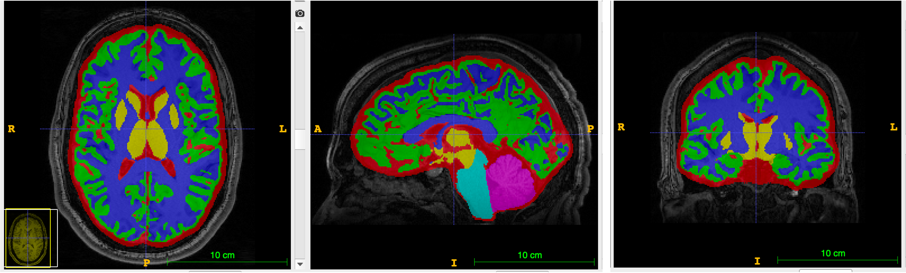
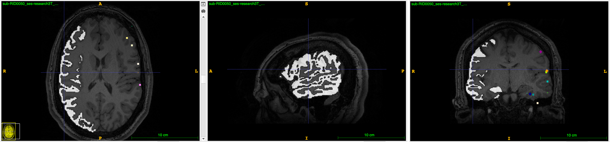

Module 3
==========

Purpose: Assign electrodes to brain regions of interest (ROIs)

Description
--------------

Module 3 assigns electrodes in the pre-implant MRI space to a specific brain region of interest (ROI). The brain can be subdivided into contiguous regions of interest (ROIs) based on the structural or functional similarity within each region. Users can input any brain atlas (e.g. AAL atlas, Lausanne Atlas, DKT Atlas) to Module 3, and recieve the ROI assignment for each electrode as an output. 

* Input Files:
   - Pre-implant MRI: anat/:blue:`sub-XXXX_`:red:`ses-YYYY`\_acq-3D\_\ :green:`space-T00mri`\_\ :pink:`T1w`.nii.gz
   - Post-implant CT: ct/:blue:`sub-XXXX_`:red:`ses-YYYY`\_acq-3D\_\ :green:`space-T01ct`\_\ :pink:`ct`.nii.gz
   - Electrode coords in CT space: ieeg/:blue:`sub-XXXX_`:red:`ses-YYYY`\_\ :green:`space-T01ct`\_ :cyan:`desc-vox`\_\ :pink:`electrodes`.txt
  
* Output Files (in `sub-xxx/derivatives/ieeg_recon/module3/`)
   - sub-XXX_ses-YYYY_space-T00mri_atlas-ZZZZ_radius-#_desc-vox_coordinates.csv
   - sub-XXX_ses-YYYY_space-T00mri_atlas-ZZZZ_radius-#_desc-vox_coordinates.json
   - sub-XXX_ses-YYYY_space-T00mri_atlas-ZZZZ_radius-#_desc-vox_coordinates.txt
   - sub-XXX_ses-YYYY_space-T00mri_atlas-ZZZZ_radius-#_sampling_mask.nii.gz
   - sub-XXX_ses-YYYY_space-T00mri_atlas-ZZZZ.nii.gz
   - MNI/
      - greedy_afine_fsl.mat
      - greedy_afine.mat
      - sub-XXX_ses-YYYY_acq-3D_space-MNI152NLin2009cAsym_T1w_electrode_spheres.nii.gz
      - sub-XXX_ses-YYYY_acq-3D_space-MNI152NLin2009cAsym_T1w.nii.gz
      - sub-XXX_ses-YYYY_space-MNI152NLin2009cAsym_desc-vox_electrodes.txt
      - sub-XXX_ses-YYYY_T00mri_MNI_registration.svg

Running Module 3 
-----------------

Make sure your input patient data is organized according to the pseudo-BIDS structure outlined in :ref:`Data Setup`. You can also run the tutorial with our `example data <https://www.dropbox.com/sh/ylxc586grm0p7au/AAAs8QQwUo0VQOSweDyj1v_ta?dl=0>`_. You can run Module 3 using the AntSpyNet atlas (default) or by specifying any Freesurfer Atlas. The code below demonstrates how to run Module 3 

Run using AntSpyNet atlas 
^^^^^^^^^^^^^^^^^^^^^^^

.. tabs::

   .. tab:: Docker

      .. code-block:: console
         
         $ docker run -v absolute/path/to/exampleData:/source_data lucasalf11/ieeg_recon -s sub-RID0922 -m 3 -cs ses-clinical101 -rs ses-clinical01 -d /source_data -r 2 -apn

         | Arguments:
         | -s: subject ID
         | -m: Module number
         | -cs: name of session with CT scan
         | -rs: name of session with reference MRI scan
         | -d: path to BIDS directory
         | -r: radius
         | -apn: run AntsPyNet DKT and Atropos segmentation

   .. tab:: Python

      .. code-block:: console

         $ conda activate ieeg_recon
         $ cd python
         $ python ieeg_recon.py -s sub-RID0922 -m 3 -cs ses-clinical01 -rs ses-clinical01 -d ../exampleData -r 2 -apn

         | Arguments:
         | -s: subject ID
         | -m: Module number
         | -cs: name of session with CT scan
         | -rs: name of session with reference MRI scan
         | -d: path to BIDS directory
         | -r: radius (in mm) of the electrode spheres used to assign regions to each electrode
         | -apn: run AntsPyNet DKT and Atropos segmentation

   .. tab:: Matlab

      .. code-block:: Matlab

        % Set up
        subID = 'sub-RID0922';          % subject ID
        ct_session = 'ses-clinical01';  % name of session with CT scan
        mri_session = 'ses-clinical01'; % name of session with reference MRI scan
        BIDS_dir = '../exampleData';    % path to BIDS directory

        subject_rid922 = ieeg_recon(subID, ct_session, mri_session, BIDS_dir);

        % Run Module 3
        fileLocations = subject_rid0922.module3;

Run specifying any Freesurfer atlas
^^^^^^^^^^^^^^^^^^^^^^^^^^^^^^

* Replace ``-apn`` with the following to specify a particular freesurfer atlas and parcellation labels:
    * ``-a /path/to/NIFTI``
    * ``-an /path/to/atlas/segmentation``
    * ``-lut /path/to/roi_csv`` (e.g. DKTatlas+aseg+VEP_lut.csv)
* If ROI labels and coordinates are separate, you can further replace ``-lut`` with:
    * ``-ri /path/to/ROI indices`` (e.g. DKTatlas+aseg+VEP_indices.txt)
    * ``-rl /path/to/ROI_labels`` (e.g. DKTatlas+aseg+VEP_labels.txt) 

.. note:: 
   For the atlas lookup tables, all of the regions that the atlas has need to be included. Having more regions than those found for any given subject is okay, but having less regions is not okay.

   For example, if you want to use the DKT atlas, make sure the atlas lookup table you provide has all of the DKT atlas labels - even if you want to ignore certain labels, this is not where this should be done. Removing brain regions should be done in post-processing.

Optional Arguments
^^^^^^^^^^^^^^^^^^^^^

* ``-mni`` run an additional MNI registration for visualization purposes

Example for running Module 3 using Greedy, running AntsPyNet DKT segmentation, generating MNI ROI assignments, and using a radius of 2 mm. 

.. tabs::

   .. tab:: Docker

      .. code-block:: console
         
         $ docker run -v absolute/path/to/exampleData:/source_data lucasalf11/ieeg_recon -s sub-RID0922 -m 3 -cs ses-clinical01 -rs ses-clinical01 -r 2 -apn -mri -d /source_data

         | Arguments:
         | -s: subject ID
         | -m: Module number
         | -cs: name of session with CT scan
         | -rs: name of session with reference MRI scan
         | -d: path to BIDS directory
         | -r: radius
         | -apn: use atropos atlas from AntsPyNet
         | -mni: (optional) perform MNI registration 

   .. tab:: Python

      .. code-block:: console

         $ conda activate ieeg_recon
         $ cd python
         $ python ieeg_recon.py -s sub-RID0922 -m 3 -cs ses-clinical101 -rs ses-clinical01 -d absolute/path/to/exampleData -r -apn -mni

         | Arguments:
         | -s: subject ID
         | -m: Module number
         | -cs: name of session with CT scan
         | -rs: name of session with reference MRI scan
         | -d: path to BIDS directory
         | -r: radius
         | -apn: use atropos atlas from AntsPyNet
         | -mni: (optional) perform MNI registration 

   .. tab:: Matlab

      .. code-block:: Matlab

        % Set up
        subID = 'sub-RID0922';          % subject ID
        ct_session = 'ses-clinical01';  % name of session with CT scan
        mri_session = 'ses-clinical01'; % name of session with reference MRI scan
        BIDS_dir = '../exampleData';    % path to BIDS directory

        subject_rid922 = ieeg_recon(subID, ct_session, mri_session, BIDS_dir);

        % Run Module 3
        fileLocations = subject_rid0922.module3;

Module 3 Outputs
--------------

Example output of atropos atlas in MRI (T00) space, obtained by using the -apm flag for sub-XXX_ses-YYYY_space-T00mri_atlas-atropos.nii.gz:

Example output of atropos atlas `mask`` in MRI (T00) space using radius = 2 (sub-RID050-ses-research3T_space-T00mri_atlas-atropos_radius-2_sampling_mask.nii.gz). Voxels in brain regions that contain electrodes have a value of 1. Electrode spheres from the output of Module 2 are also shown in the image below:

.. autosummary::
   :toctree: generated

   ieeg-recon
