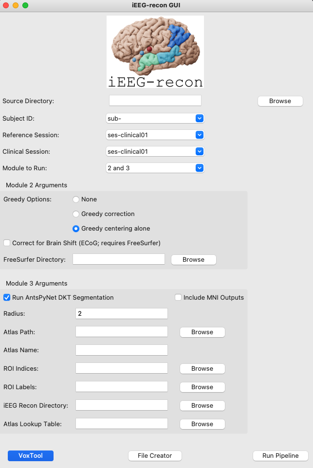
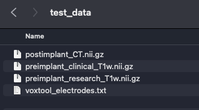
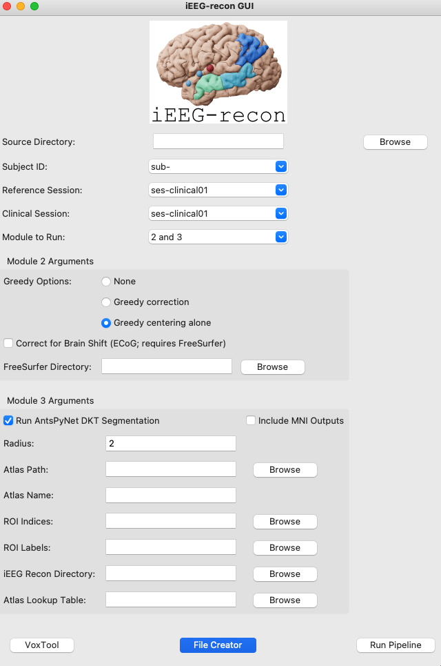
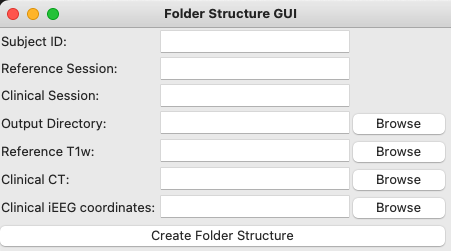
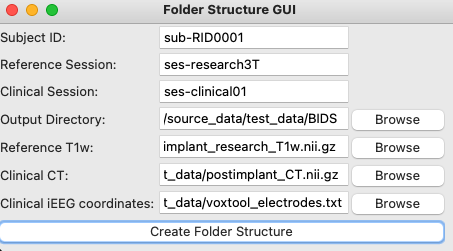
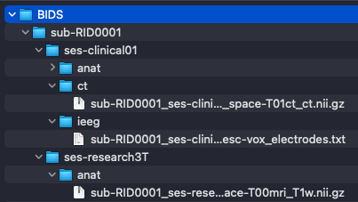
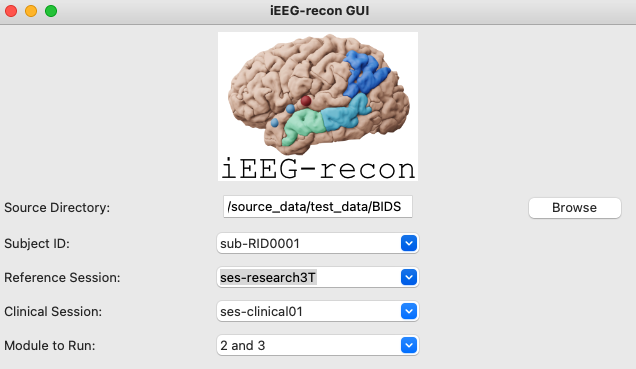
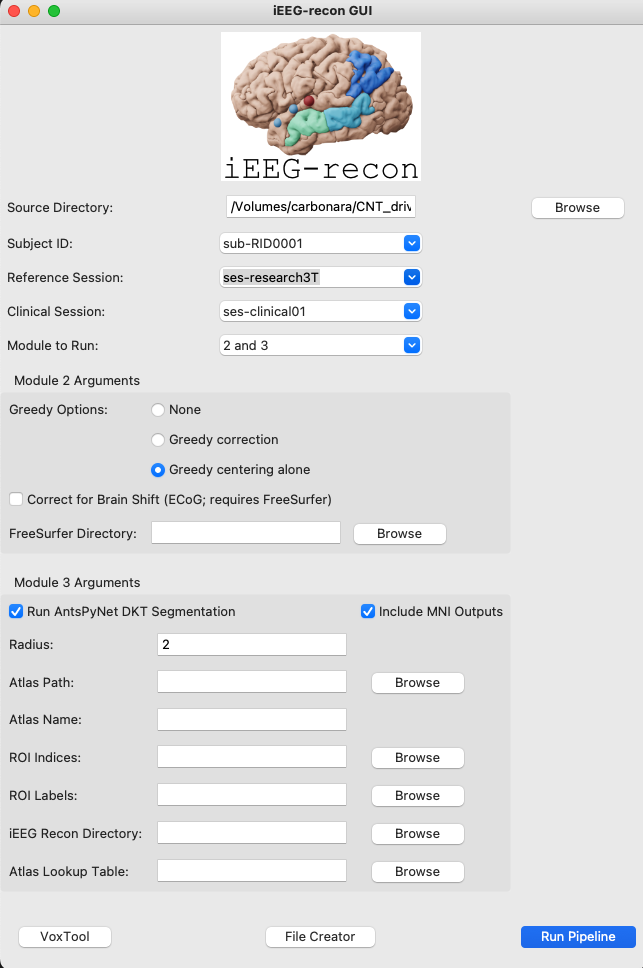
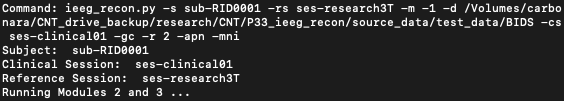
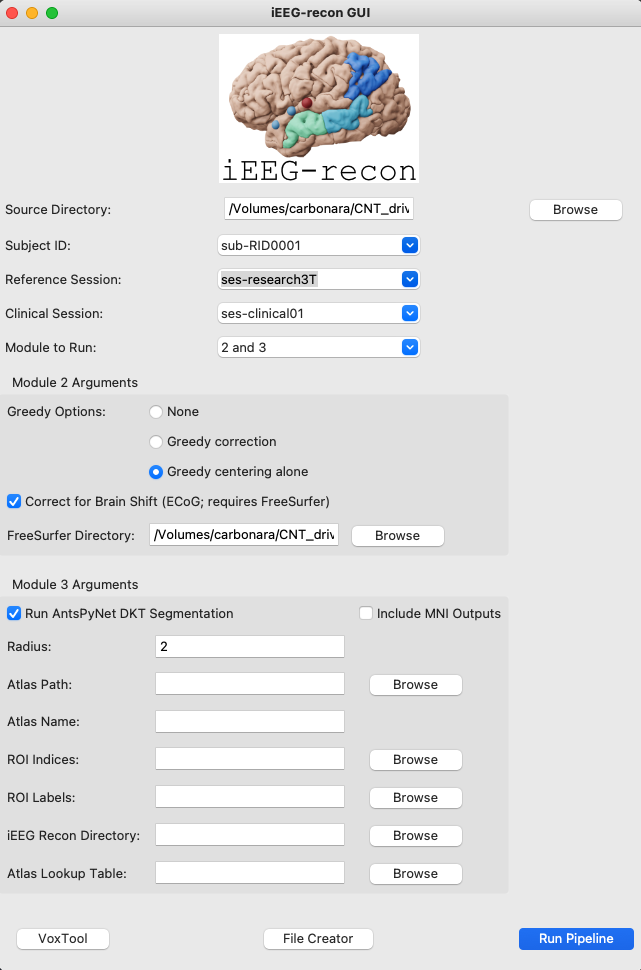

This tutorial shows how to run a complete reconstruction with `iEEG-recon` using the GUI.

# Module 1: VoxTool

To run VoxTool for electrode labeling, select the VoxTool option at the bottom of the GUI

This will bring up the VoxTool window where electrode labeling will take place

A detailed tutorial for using VoxTool can be found here:

# Creating required folders for Modules 2 and 3

Modules 2 and 3 use specific folder structures in order to ensure consistency across runs. A minimum of 3 files are needed:

- A reference pre-implant T1w MRI - This MRI can be a clinical MRI or a research MRI (this should be a `nii.gz` file)
- A post-implant CT scan where the electrodes are visible (this should be a `.nii.gz` file)
- A VoxTool electrode coordinates file, where the electrodes are labeled on the above CT scan (this should be a `.txt` file) 

Note that the imaging files must be in NIFTI format. If your data is in DICOM, please use `dcm2niix` (https://github.com/rordenlab/dcm2niix). 

Once those files are available, they need to be placed in the folder structure required by iEEG-recon. Starting from arbitrarily named files:

The GUI has a `File Creator` option:

Here the user can specify the Subject ID (in BIDS format, e.g. `sub-RID0001`), as well as the names for the reference and clinical sessions (also in BIDS format, `ses-clinical01`, `ses-research3T`)

After naming the subject and the sessions, the user can then select the `Output Directory` where the restructured  user directory will be created. This output directory will be the input to `Source Directory` in the main GUI. The other files would be those described above. After the path to all the files is provided, the folder structure can be generated by clicking `Create Folder Structure`

The output folder structure is immediately compatible with iEEG-recon:

# Running Modules 2 and 3

After the folder structure is created, use the root BIDS directory as the `Source Directory` in the main GUI. This will automatically populate a list of available subjects, reference sessions and clinical sessions.

If the combo-boxes are not automatically populated, the `Source Directory` is incorrect. The user can then choose which modules they would like to run. In this example, both modules 2 and 3 were selected.

In this case, we want to run using `Greedy Centering Alone`, in Module 2. For Module 3, we want to use ANTsPyNet for segmentation and we also want to include outputs in MNI space for further analysis. With these options selected, only the Radius used for assigning electrodes must be specified (Default `2`), and `Run Pipeline` can be selected after to run the entire pipeline:

The accompanying terminal will show the command used as well as the specified parameters:

The user can then use this command with other subjects directly from the command line if needed, or repeat the process from the GUI.

# Brain Shift Correction

To run iEEG-recon with brain shift correction, follow the same steps as before, but select the `Correct for Brain Shift` option. If you do so, then you must provide a FreeSurfer directory, which is the result of the output of `recon-all` executed on the reference T1w image used for the reconstruction:

